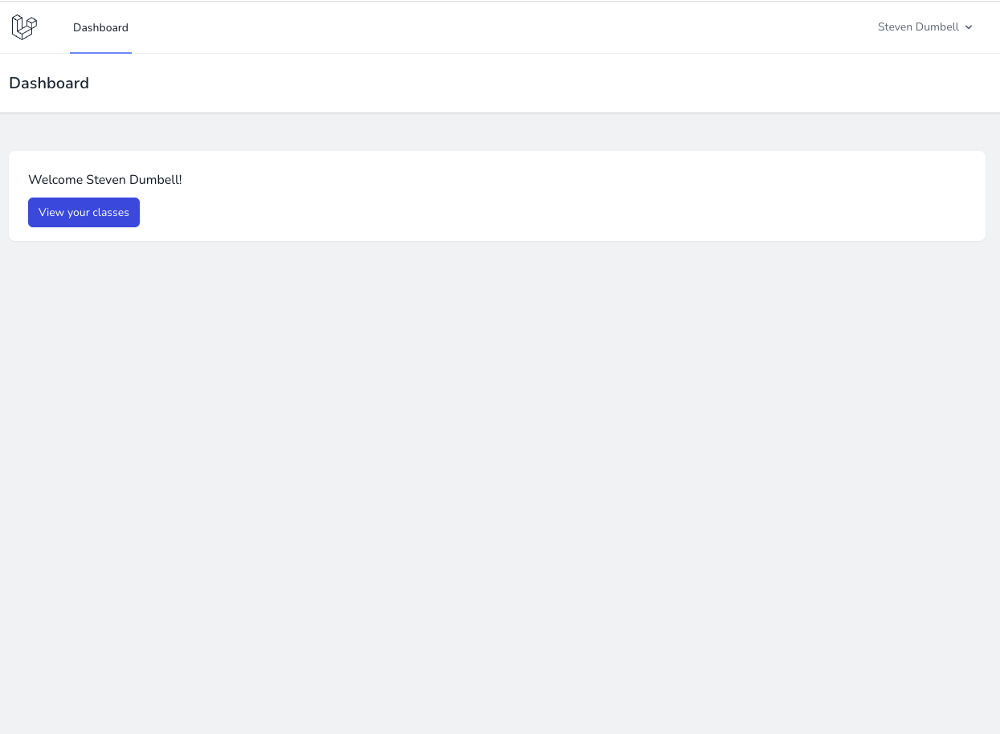
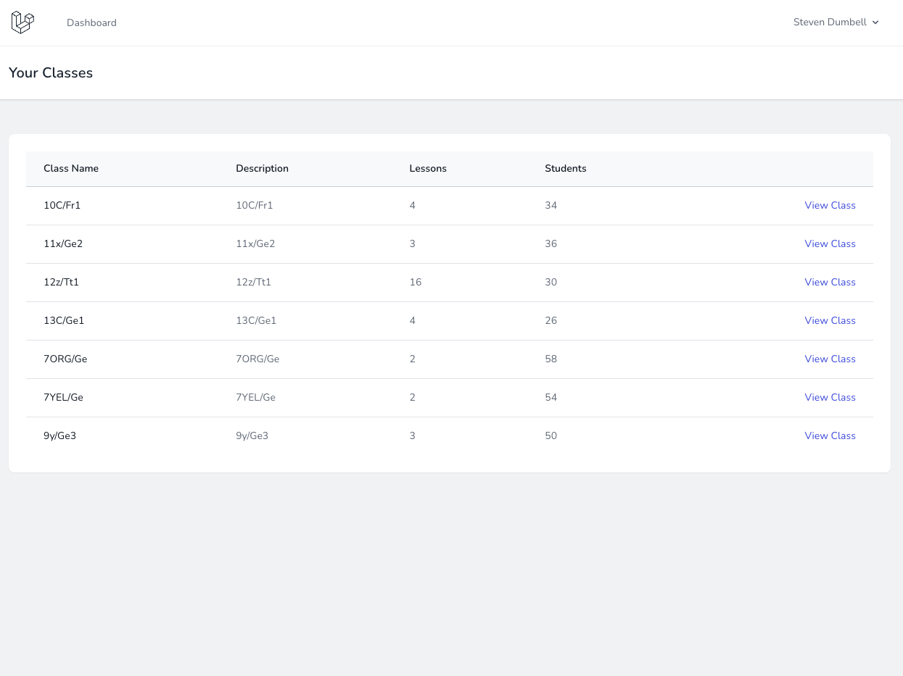
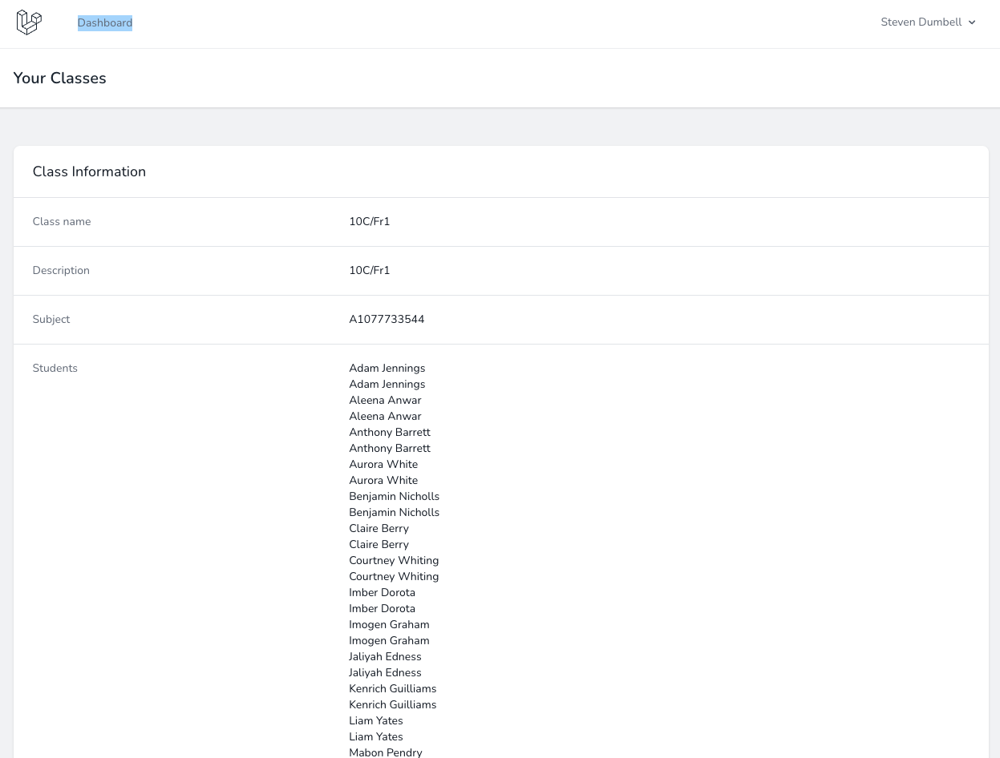

# Wonde Technical Exercise

## Task Details
### User Story:
As a Teacher I want to be able to see which students are in my class each day of the week so that I can be suitably prepared.

### Notes:

You can use any technology that you think is suitable for this task.

The brief has been kept deliberately vague to allow you scope to apply your own assumptions and interpretations and to demonstrate your skills.

## Assumptions

* There is a stable and secure login system in place
* A teacher would have a login to get to a full admin panel
* Data would be pulled from the Wonde API periodically (I think I saw hourly mentioned?) using a queue system

## Caveats

* The queue system is replaced by an Artisan command that can be run manually
* The Teacher login is manually created from employee `A921160679` in the Wonde API
  * Email is `Dumbell@example.com`
  * Password is `Password123`
* Written tests are representative of what I would normally do, not comprehensive
  * I would usually mock the Wonde API and test the API calls in isolation to have stable data

## Installation
1. Clone the repo
2. Copy `.env.example` to `.env`
3. Edit `.env` to set your Wonde API key
4. Run `composer install`
5. Run `npm install`
6. Run `php artisan migrate` which creates the `sqlite` database at `database/database.sqlite`
7. Run `php artisan run:queue` to pull data from the Wonde API
8. Run `php artisan serve` to start the server

## Files/folders of note

* `app/Http/Models/*` - The models which hold the data
* `app/database/migrations/*` - The migrations for the database
* `app/database/database.sqlite` - The database (should be created by migrate, if not create it manually)
* `app/Console/Commands/RunQueue.php` - The artisan command to pull data from the Wonde API
* `tests/Unit/*` - The unit tests
* `tests/Feature/*` - The feature tests
* `app/Http/Controllers/*` - The controllers

## Screenshots

